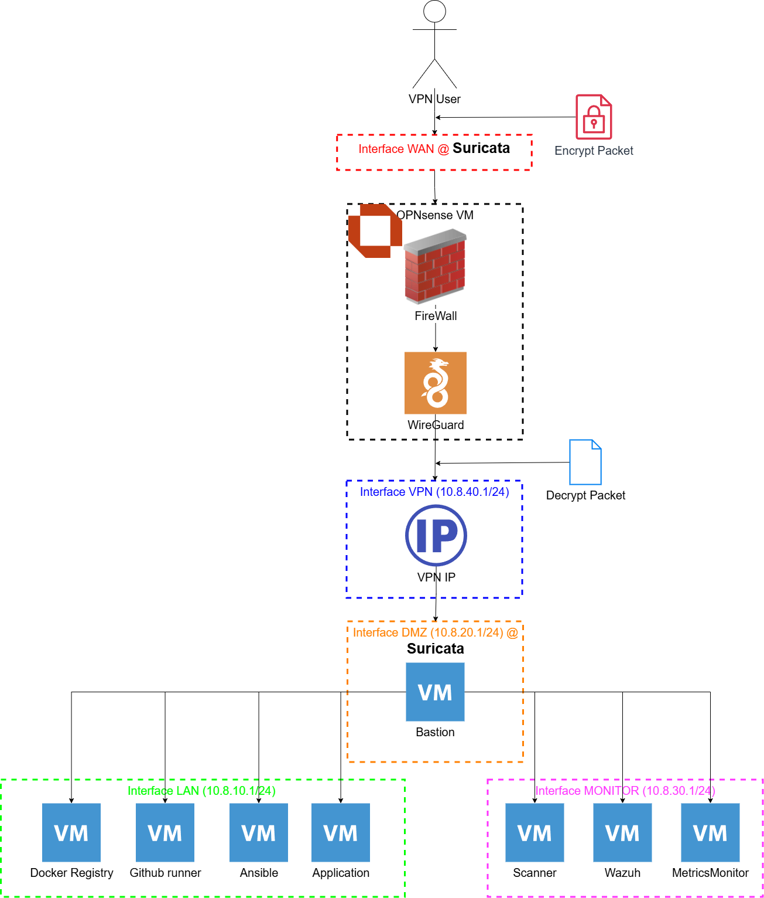
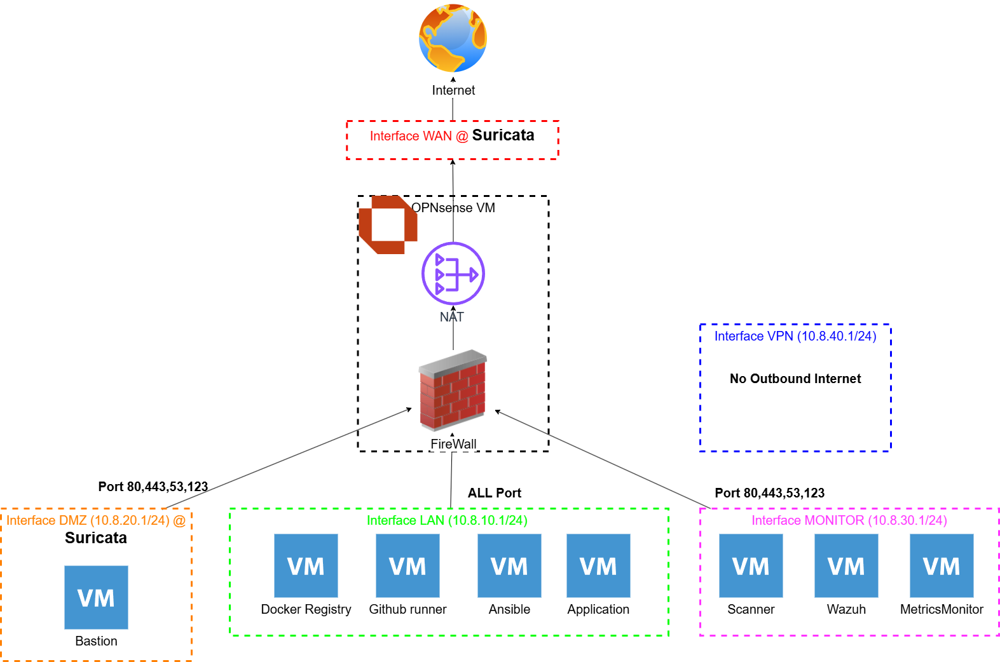
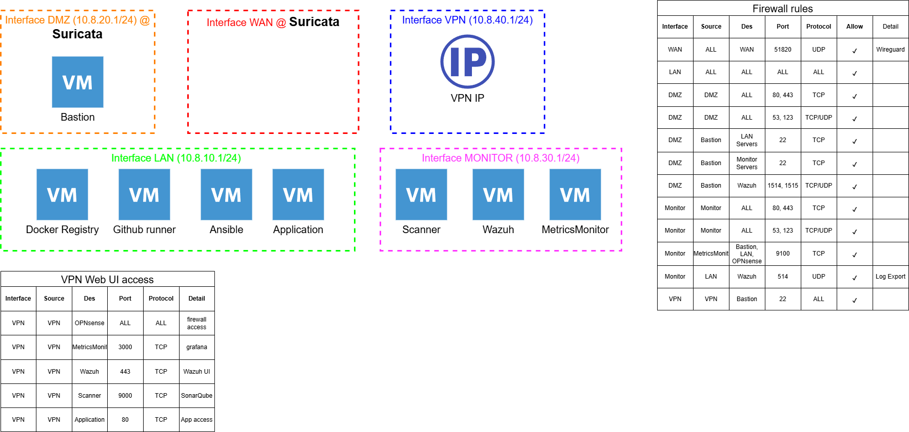
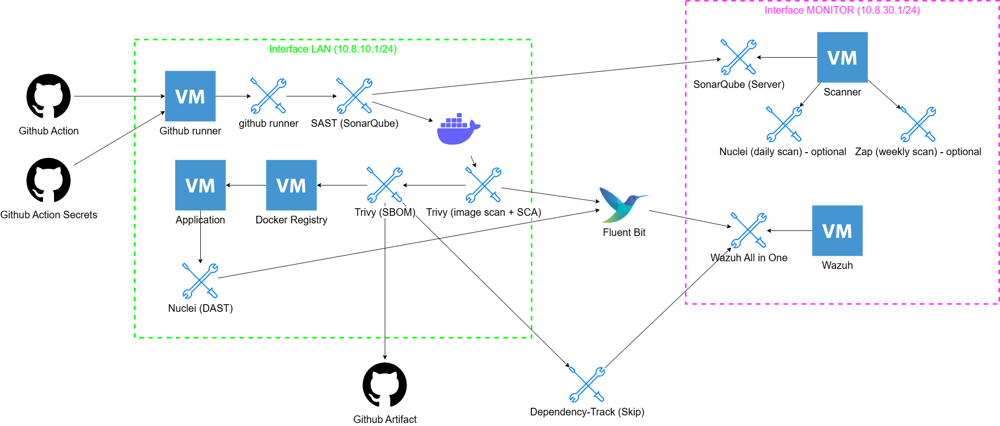

# DevSecOps Homelab

A personal DevSecOps lab simulates DevSecOps environment with:
- Network segmentation
- CI/CD security
- Container security scanning
- SIEM monitoring
- Secure remote access

## Goals

- This project builds a private lab that include firewall, CI/CD pineline, SIEM, IDS/IPS, Vulnerable web application
- it is designed to stimulate a real system to learn how to apply scan from first to devops process.
- The scope of this project covers network overview, but does not include how to build an application.

## Architecture

This homelab is built as a self-hosted DevSecOps platform focused on GitOps, observability, and secure CI/CD automation.

### Core Components

| Layer                               | Technologies        |
| ----------------------------------- | ------------------- |
| Virtualization                      | Proxmox VE          |
| Container Runtime                   | Docker              |
| Configuration Management            | Ansible             |
| CI/CD                               | GitHub Actions      |
| Code Quality & SAST                 | SonarQube           |
| Vulnerability Scanning & SCA        | Trivy               |
| DAST                                | Nuclei              |
| Observability                       | Prometheus, Grafana |
| Log Management                      | Fluent Bit          |
| Endpoint Detection & Response (EDR) | Wazuh Agent         |
| SIEM & Security Monitoring          | Wazuh               |
| Networking & Firewall               | OPNsense            |
| IDS/IPS                             | Suricata            |
| Secure Remote Access                | WireGuard           |

### Architecture Diagram

#### Inbound from internet flow

#### Outbound to internet flow

#### Internal communication flow

#### CI/CD flow

### Deployment Workflow

1. Developer pushes code to GitHub
2. GitHub Actions runs CI pipeline in self-host runner machine
3. Self-host runner: run SAST scan and push result to SonarQube server.
4. Self-host runner: Docker image is build from application
5. Self-host runner: Trivy scan the image and upload result to wazuh via Fluent Bit
6. Self-host runner: Trivy generate SBOM file and upload to github artifact. 
7. Self-host runner: push image to self-host docker registry
8. Self-host runner: SSH to application machine and run deploy.sh 
9. Self-host runner: trigger DAST scan (Nuclei)
   
## Design Decisions

## Infrastructure

## CI/CD Pipeline

## GitOps Workflow

## Security Stack

## Observability Stack

## Repository Structure

## Deployment Workflow

## Disaster Recovery

## Lessons Learned

## Future Improvements

